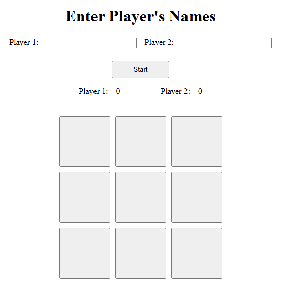

# 🎮 Tic-Tac-Toe (JavaScript)

A simple **Tic-Tac-Toe** game built in JavaScript using **factory functions** and **modular design principles**.
The project begins as a console-based game, later expanding to a fully interactive DOM version.

---

## 🧩 Objective

Build a functional and cleanly structured Tic-Tac-Toe game that:

- Uses as little global code as possible.
- Emphasizes modularity through **factory functions**.
- Separates **game logic** and **DOM manipulation**.
- Supports **two-player gameplay** and tracks the game state.

---

## 🏗️ Structure & Objects

### Core Modules

- **Gameboard Object** – Stores the board state as a 2D array.
- **Player Factory** – Creates player objects with unique symbols and names.
- **Game Flow Controller** – Manages turns, win conditions, and overall logic.

---

## 🎯 Development Goals

- ✅ Build the game to function in the **console** first.
- ✅ Once logic is complete, add a **DOM handler** for display.
- ✅ Allow players to:

  - Enter their names
  - Start and restart the game

- ✅ Display game results (keep score).
- ✅ Keep code **clean**, **modular**, and **readable**.

---

## 🖥️ Demo

---

## 💡 Notes

This project follows **The Odin Project’s** JavaScript curriculum principles for modular code design, emphasizing readability and reusability.

---
